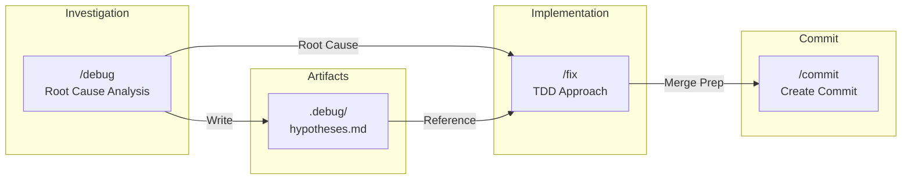

## Slash Commands

### Available Commands

| Command | Description | Arguments |
|---------|-------------|-----------|
| `/brainstorm` | Develop ideas into detailed specifications through iterative Q&A | - |
| `/commit` | Commit with parallel subagent analysis and best practices | `[scope] [--no-session]` |
| `/debug` | Debug and identify root cause with hypothesis tracking | `<bug description>` |
| `/fix` | Test-driven fix implementation with RGRC cycle | `<fix description>` |

### Naming Conventions
- Name files by action (WHAT), not methodology (HOW)
- Express what the user wants to do, not how it's done internally

| Avoid | Prefer | Reason |
|-------|--------|--------|
| `/tdd` | `/fix` | TDD is methodology, fix is action |
| `/rca` | `/debug` | RCA is methodology, debug is action |

### Slash Command Relationship

## References

Essential resources for Claude Code development and best practices:

### Official Documentation
- [Claude Code: Overview](https://docs.anthropic.com/en/docs/claude-code/overview). Can be access by `claude.md` as well.
- [Claude Code: Best practices for agentic coding](https://www.anthropic.com/engineering/claude-code-best-practices) - Official Anthropic development guidelines

### Community Resources
- [Awesome Claude Code](https://github.com/hesreallyhim/awesome-claude-code) - Curated collection of commands, files, and workflows
- [Claude Code Hooks Mastery](https://github.com/disler/claude-code-hooks-mastery) - Complete guide to Claude Code hooks implementation
- [Context Engineering Introduction](https://github.com/coleam00/context-engineering-intro) - Fundamentals of AI coding assistant context management
- [How to Master Claude MD Files in Claude Code](https://empathyfirstmedia.com/claude-md-file-claude-code/) - Comprehensive guide for CLAUDE.md structure

### Tools & Templates
- [Claude Code Templates](https://github.com/davila7/claude-code-templates) - CLI tool for rapid project setup and monitoring
- [Claude Crash Course Templates](https://github.com/bhancockio/claude-crash-course-templates) - Production-ready templates for AI-driven development

### Advanced Techniques
- [Claude Code: Subagent Deep Dive](https://cuong.io/blog/2025/06/24-claude-code-subagent-deep-dive) - Parallel task execution using Claude Code's Task tool
- [ClaudeLog](https://claudelog.com/) - In-depth experiments and mechanics exploration

## Acknowledgements

Special thanks to the following contributors whose work forms the foundation of this configuration:

- **[harperreed](https://github.com/harperreed/dotfiles)** - Base architecture for `.claude/commands/brainstorm` and configuration patterns
- **[FirasLatrech's Cursor Debugging & Planning Guidelines](https://gist.github.com/FirasLatrech/415d243f1ea48f63dfc691c8ceedefc4)** - Debugging and planning framework for `.claude/commands/debug` and `.claude/commands/fix`
