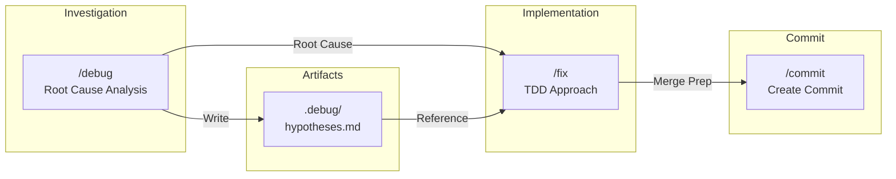
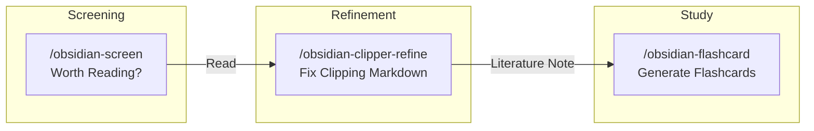

## Directory Structure

```
.claude/
├── CLAUDE.md              # Project-level instructions (coding principles, security, workflow)
├── README.md              # This file
├── settings.json          # Shared settings (permissions, hooks, plugins, statusline)
├── statusline.sh          # Status line entry point (sources modules from statusline/)
├── statusline/            # Modular statusline components
│   ├── LICENSE
│   ├── README.md
│   ├── colors.sh          # Color definitions, fish-style path shortening, progress bar helpers
│   ├── context.sh         # JSON extraction, session time, and Line 1 assembly
│   ├── git.sh             # Git branch and dirty state detection
│   ├── oauth.sh           # OAuth token resolution for API usage fetch
│   └── usage.sh           # API rate limit display with caching (current/weekly/extra)
├── commands/              # Slash commands
│   ├── brainstorm.md
│   ├── commit.md
│   ├── debug.md
│   ├── fix.md
│   ├── obsidian-clipper-refine.md
│   ├── obsidian-flashcard.md
│   └── obsidian-screen.md
└── rules/                 # Path-scoped rules (loaded only when matching files are edited)
    ├── github-actions.md  # **/.github/workflows/**, **/.github/actions/**
    ├── python.md          # **/*.py, **/pyproject.toml
    ├── rust.md            # **/*.rs, **/Cargo.toml, **/Cargo.lock
    └── typescript.md      # **/*.ts, **/*.tsx, **/*.mts, **/tsconfig*.json, **/package.json
```

## Slash Commands

### Available Commands

#### Development

| Command | Description | Arguments |
|---------|-------------|-----------|
| `/brainstorm` | Develop ideas into detailed specifications through iterative Q&A | - |
| `/commit` | Commit with parallel subagent analysis and best practices | `[scope]` |
| `/debug` | Debug and identify root cause with hypothesis tracking | `<bug description>` |
| `/fix` | Test-driven fix implementation with RGRC cycle | `<fix description>` |

#### Obsidian

| Command | Description | Arguments |
|---------|-------------|-----------|
| `/obsidian-clipper-refine` | Clean and fix Web Clipper markdown using original article | `<clipping filename>` |
| `/obsidian-flashcard` | Generate English flashcards from Literature Note | `<literature note path>` |
| `/obsidian-screen` | Get overview of Clippings to decide if worth reading | `<clipping filename>` |

### Naming Conventions
- Name files by action (WHAT), not methodology (HOW)
- Express what the user wants to do, not how it's done internally

| Avoid | Prefer | Reason |
|-------|--------|--------|
| `/tdd` | `/fix` | TDD is methodology, fix is action |
| `/rca` | `/debug` | RCA is methodology, debug is action |

### Slash Command Relationship


```mermaid
flowchart LR
    subgraph Investigation
        debug["/debug<br/>Root Cause Analysis"]
    end

    subgraph Implementation
        fix["/fix<br/>TDD Approach"]
    end

    subgraph Commit
        commit["/commit<br/>Create Commit"]
    end

    subgraph Artifacts
        hypotheses[".debug/<br/>hypotheses.md"]
    end

    debug -->|Root Cause| fix
    debug -->|Write| hypotheses
    hypotheses -->|Reference| fix
    fix -->|Merge Prep| commit
```


```mermaid
flowchart LR
    subgraph Screening
        screen["/obsidian-screen<br/>Worth Reading?"]
    end

    subgraph Refinement
        refine["/obsidian-clipper-refine<br/>Fix Clipping Markdown"]
    end

    subgraph Study
        flashcard["/obsidian-flashcard<br/>Generate Flashcards"]
    end

    screen -->|Read| refine
    refine -->|Literature Note| flashcard
```

## Rules

Path-scoped rules in `rules/`. Each file specifies glob patterns in its frontmatter and is loaded only when matching files are being edited, saving context tokens.

| File | Paths | Covers |
|------|-------|--------|
| `github-actions.md` | `**/.github/workflows/**`, `**/.github/actions/**` | Action pinning, security, Dependabot |
| `python.md` | `**/*.py`, `**/pyproject.toml` | `uv` toolchain, linting, testing |
| `rust.md` | `**/*.rs`, `**/Cargo.toml` | Cargo toolchain, clippy, error handling |
| `typescript.md` | `**/*.ts`, `**/*.tsx`, etc. | `pnpm` toolchain, type safety, naming |

## Configuration

### settings.json (shared)

Committed to the repo. Includes:
- **permissions** - Allowed and denied tool patterns (e.g., deny `rm -rf`, `sudo`, reading secrets)
- **hooks** - Notification and Stop hooks (plays system sound on completion)
- **plugins** - TypeScript LSP, Rust Analyzer LSP, Go LSP
- **statusline** - Runs `statusline.sh` to show model, directory, context, git, and usage info
- **env** - Disables telemetry and bug reporting, enables experimental agent teams
- **alwaysThinkingEnabled** - Extended thinking enabled by default
- **attribution** - Commit and PR attribution settings
- **cleanupPeriodDays** - Auto-cleanup period for old data (14 days)

### statusline.sh

Entry point that sources modular components from `statusline/`. Displays a single-line status bar:

`Model │ X% left │ ~/P/dir (branch*) │ ⏱ 5m │ ◐ thinking`
- Model name, context window remaining %, fish-style shortened path, git branch with dirty indicator, session duration, thinking mode status

## References

Essential resources for Claude Code development and best practices:

### Official Documentation
- [Claude Code: Overview](https://docs.anthropic.com/en/docs/claude-code/overview). Can be access by `claude.md` as well.
- [Claude Code: Best practices for agentic coding](https://www.anthropic.com/engineering/claude-code-best-practices) - Official Anthropic development guidelines

### Community Resources
- [Awesome Claude Code](https://github.com/hesreallyhim/awesome-claude-code) - Curated collection of commands, files, and workflows
- [Everything Claude Code](https://github.com/affaan-m/everything-claude-code) - Comprehensive guide covering setup, CLAUDE.md, MCP, and workflows
- [Claude Code Best Practice](https://github.com/shanraisshan/claude-code-best-practice/tree/main) - Best practices for Claude Code configuration and usage
- [Claude Code Hooks Mastery](https://github.com/disler/claude-code-hooks-mastery) - Complete guide to Claude Code hooks implementation
- [Context Engineering Introduction](https://github.com/coleam00/context-engineering-intro) - Fundamentals of AI coding assistant context management
- [How to Master Claude MD Files in Claude Code](https://empathyfirstmedia.com/claude-md-file-claude-code/) - Comprehensive guide for CLAUDE.md structure
- [Agent Config](https://github.com/brianlovin/agent-config) - Brian Lovin's agent configuration reference

### Tools & Templates
- [Claude Code Templates](https://github.com/davila7/claude-code-templates) - CLI tool for rapid project setup and monitoring
- [Claude Crash Course Templates](https://github.com/bhancockio/claude-crash-course-templates) - Production-ready templates for AI-driven development

### Advanced Techniques
- [Claude Code: Subagent Deep Dive](https://cuong.io/blog/2025/06/24-claude-code-subagent-deep-dive) - Parallel task execution using Claude Code's Task tool
- [ClaudeLog](https://claudelog.com/) - In-depth experiments and mechanics exploration

## Acknowledgements

Special thanks to the following contributors whose work forms the foundation of this configuration:

- **[harperreed](https://github.com/harperreed/dotfiles)** - Base architecture for `.claude/commands/brainstorm` and configuration patterns
- **[FirasLatrech's Cursor Debugging & Planning Guidelines](https://gist.github.com/FirasLatrech/415d243f1ea48f63dfc691c8ceedefc4)** - Debugging and planning framework for `.claude/commands/debug` and `.claude/commands/fix`
- **[kamranahmedse/claude-statusline](https://github.com/kamranahmedse/claude-statusline)** - Statusline script for Claude Code, basis for `statusline/` modules (MIT License)
