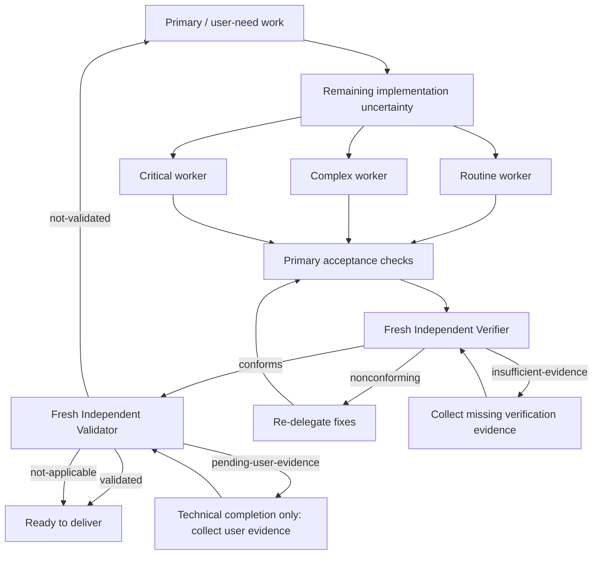

```mermaid
flowchart TD
    primary["Primary / user-need work"] --> uncertainty["Remaining implementation uncertainty"]
    uncertainty --> routine["Routine worker"]
    uncertainty --> complex["Complex worker"]
    uncertainty --> critical["Critical worker"]
    routine --> checks["Primary acceptance checks"]
    complex --> checks
    critical --> checks
    checks --> verifier["Fresh Independent Verifier"]
    verifier -->|conforms| validator["Fresh Independent Validator"]
    verifier -->|nonconforming| fixes["Re-delegate fixes"]
    fixes --> checks
    verifier -->|insufficient-evidence| missing["Collect missing verification evidence"]
    missing --> verifier
    validator -->|validated| ready["Ready to deliver"]
    validator -->|not-applicable| ready
    validator -->|pending-user-evidence| userEvidence["Technical completion only: collect user evidence"]
    userEvidence --> validator
    validator -->|not-validated| primary
```
