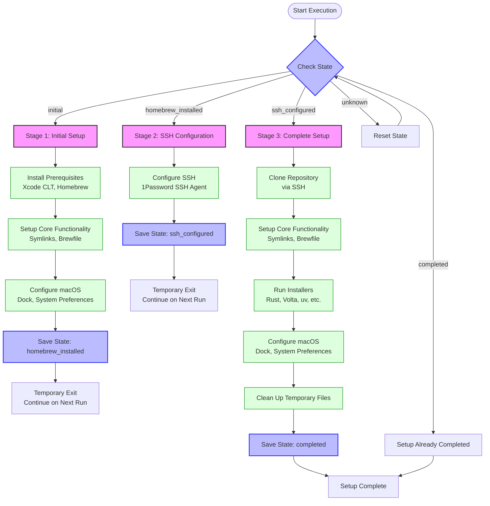

# dotfiles

A streamlined configuration management system for macOS development environments.

## Quick Start

Run this single command to begin the automated setup:

```bash
bash -c "$(curl -fsSL https://raw.githubusercontent.com/sotayamashita/dotfiles/main/bootstrap.sh)"
```

## How It Works

This repository uses a multi-stage setup process to handle SSH dependency constraints on fresh macOS installations:



### Setup Process Stages

1. **Initial Setup**
   - Downloads and applies basic configuration
   - Installs essential tools (Xcode Command Line Tools, Homebrew)
   - No SSH required at this stage

2. **SSH Configuration**
   - Sets up 1Password SSH Agent for GitHub authentication
   - Prepares secure access for repository cloning

3. **Complete Setup**
   - Clones the repository via SSH for proper version control
   - Installs all tools and applies full configuration
   - Configures macOS preferences

## Manual Setup Alternative

If you prefer more control, you can run the setup process manually:

### Stage 1: Initial Setup (No SSH Required)

```bash
cd
curl -#L https://github.com/sotayamashita/dotfiles/tarball/main | tar -xzv --strip-components 1 --exclude={README.md}
~/scripts/modules/core/symlinks.sh
~/scripts/modules/core/brew.sh
rm -rf ~/scripts
```

This will:
- Download the repository as a tarball to your home directory
- Install essential tools
- Apply basic configuration
- Clean up temporary files

### Stage 2: Complete Setup (SSH Required)

After completing the initial setup:

1. **Configure 1Password SSH Agent**:
   - Install 1Password from Homebrew
   - Enable SSH Agent in 1Password:
     1. `open -a "1Password"`
     2. Press <kbd>⌘ + ,</kbd> to open Preferences
     3. Navigate to Developer > Use the SSH Agent and enable it

   [Learn more about 1Password SSH Agent](https://developer.1password.com/docs/ssh/agent/)

2. **Clone repository to permanent location**:
   ```bash
   git clone git@github.com:sotayamashita/dotfiles.git ~/Projects/dotfiles
   cd ~/Projects/dotfiles
   ```

3. **Run setup scripts**:
   ```bash
   ./scripts/modules/core/symlinks.sh
   ./scripts/modules/core/brew.sh
   ./scripts/modules/macos/preferences.sh
   ```

   [Learn more about signing Git commits with SSH](https://developer.1password.com/docs/ssh/git-commit-signing/)

## Repository Structure

```
dotfiles/
├── .config/          # Configuration files
├── installers/       # Individual tool installers
├── bootstrap.sh      # Automated setup script
└── scripts/          # Setup scripts
    ├── lib/          # Common library functions
    │   ├── utils.sh              # Utility functions
    │   └── state.sh              # State management
    ├── modules/      # Modular scripts by functionality
    │   ├── core/                 # Core functionality
    │   │   ├── symlinks.sh       # Symlink creation
    │   │   └── brew.sh           # Homebrew package management
    │   └── macos/                # macOS specific settings
    │       ├── dock.sh           # Dock configuration
    │       └── preferences.sh    # System preferences
    └── installers/   # External tool installers
```

## Platform Support

This dotfiles repository is optimized for:

- **macOS**: Full support with macOS-specific configurations

The bootstrap process automatically applies the appropriate configurations for your system.
