# Vibe Coding 101 🎨

_A Guide to Creative Coding with AI_

## Introduction: What is Vibe Coding?

Vibe Coding is a new approach to programming where you guide AI tools creatively instead of writing every line yourself. This guide introduces effective AI pair programming methods using tools like Claude Code.

> "Vibe coding is about iterating, experimenting, and guiding AI to bring your ideas to life."

## 🌟 Core Concepts

### 1. Start with Vision

Having a clear project vision is key to success:

- **What** you want to build
- **Who** you're building for
- **Why** it's needed

### 2. AI as a Collaborative Partner

AI isn't a magic solution, but a collaborator that shapes your ideas:

- You: Provide vision and domain knowledge
- AI: Handle implementation details and boilerplate
- Together: Create better solutions faster

### 3. Iterative Development

Focus on continuous improvement rather than perfection:

```
Idea → Prototype → Test → Improve → Repeat
```

## 🎯 Practical Workflow

### Step 1: Project Conceptualization

Start with three essential questions:

```markdown
## Project: [Name]

### 🎯 Who's it for?

[Specific users and their challenges in 1-2 sentences]

### 💡 Why build it?

[Problem to solve or value to deliver in 1-2 sentences]

### 🚀 What is it?

[Core features in bullet points, max 3]

- Feature 1: [Brief description]
- Feature 2: [Brief description]
- Feature 3: [Brief description]

### 🔧 Technology Validation

Verify available technologies considering AI's cutoff date:

- [ ] Search for latest framework/library versions
- [ ] Check for deprecated features or new APIs
- [ ] Confirm security updates
```

### Step 2: Effective Prompt Creation

#### ❌ Prompts to Avoid

```
"Make a ToDo app"
```

#### ✅ Recommended Prompts

```
"Create a ToDo app using React and TypeScript.
Feature requirements:
- Add/edit/delete tasks
- Categorize by type
- Set deadlines and reminders
- Persist with local storage

Use modern, minimal UI design.
Use TailwindCSS and support dark mode."
```

### Step 3: TDD Cycle Integration

Leverage our strict RED-GREEN-REFACTOR cycle:

```mermaid
graph LR
    A[🔴 RED: Write test] --> B[🟢 GREEN: Implement]
    B --> C[🔵 REFACTOR: Improve]
    C --> D[✅ APPROVE: Get approval]
    D --> A
```



### Step 4: Debug and Improve

Effective debugging sessions with AI:

1. **Provide specific error context**

   ```
   "Getting TypeError: Cannot read property 'map' of undefined at line 42.
   Data comes from external API that sometimes returns empty array."
   ```

2. **Clearly explain expected behavior**
3. **Share what you've tried**
4. **Explore solutions together**

## 💡 Prompt Engineering

### Context Layers

1. **Global Settings** (`.claude/CLAUDE.md`)

   - General development style
   - Language preferences
   - Commit conventions

2. **Project Settings** (`CLAUDE.md`)

   - Architecture decisions
   - Coding standards
   - Project-specific rules

3. **Session Context**
   - Current tasks
   - Recent changes
   - Active issues

### Effective Prompt Elements

```markdown
## Task: [Clear title]

### Background

[Why this feature is needed]

### Requirements

- [Specific requirement 1]
- [Specific requirement 2]

### Constraints

- [Technical constraints]
- [Business constraints]

### Expected Result

[Behavior when complete]

### References

- [Related docs or links]
- [Mockups or screenshots]
```

## 🛠️ Tools and Techniques

### 1. Visual Communication

- Use screenshots and mockups
- Explain complex concepts with diagrams
- Show UI expectations visually

### 2. Leverage Domain Knowledge

```
"This e-commerce site needs real-time sync with
inventory management. Out-of-stock items should
auto-hide and send notifications on restock."
```

### 3. Incremental Implementation

Break large features into small steps:

1. Implement basic functionality
2. Handle edge cases
3. Optimize performance
4. Polish UX

## 🎨 Creative Collaboration

### Scenario 1: Exploring New Features

```
You: "Looking for innovative ways to increase user engagement"
AI: Suggests multiple options
You: Select ideas and set direction
Together: Create prototype and iterate
```

### Scenario 2: Technical Challenges

```
You: "Need to identify performance bottlenecks"
AI: Analyze using profiling tools
You: Prioritize based on business requirements
Together: Implement optimizations and measure
```

### Scenario 3: Learning and Growth

```
You: "What are best practices for this new framework?"
AI: Provide latest information and patterns
You: Decide how to apply to project
Together: Put knowledge into practice
```

## 📈 Continuous Improvement

### Reflection Questions

- What was the most effective prompt today?
- Where did AI struggle?
- How can we improve communication next time?

### Feedback Loop

```
Practice → Observe → Learn → Adjust → Practice
```

## 🚀 Next Level

### Advanced Techniques

1. **Context Chaining**: Chain multiple prompts for complex tasks
2. **Prompt Templates**: Standardize frequently used patterns
3. **AI Pair Review**: Leverage AI for code reviews
4. **Automating Automation**: Have AI write automation scripts

### Mindset

- Progress over perfection
- Collaboration over solo work
- Growth mindset over fixed mindset

## 🎯 Summary

Vibe Coding isn't just about using tools—it's a new approach to creative coding. By collaborating with AI, you can try more ideas, learn faster, and build better software.

Key points:

- Have a clear vision
- Communicate effectively
- Improve iteratively
- Have fun!

---

_"The best code is the code that best serves its users, not the code that's most clever." - Vibe Coding Philosophy_
